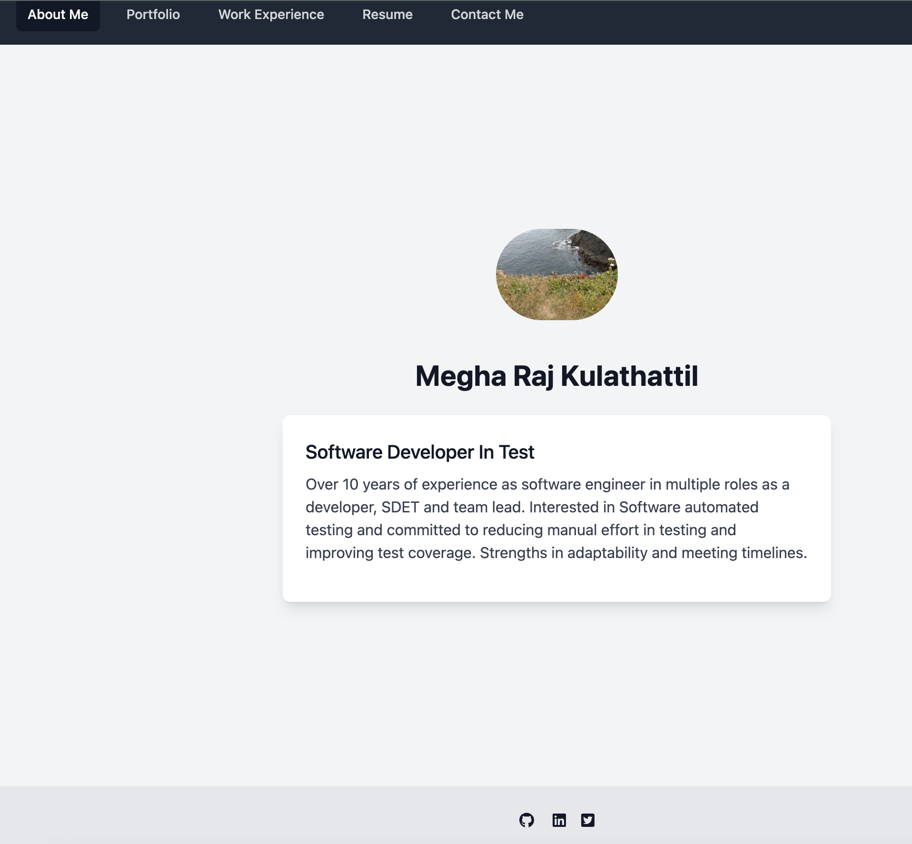

# Portfolio

## Purpose
This project was bootstrapped with [Create React App](https://github.com/facebook/create-react-app).
The website provides an online resume for me.
* There are links to portfolio, work experience , resume and contact me.
* Clicking on resume opens up a resume pdf.
* Clicking on other links take the user to corresponding section.
* Portfolio section provides options to view github repo and deployed application

## Built With
* Html
* CSS
* React
* TailwindCSS

## Run the application
* Clone Repo.
* Run npm i.
* Run npm start`

Runs the app in the development mode.
Open [http://localhost:3000](http://localhost:3000) to view it in your browser.

The page will reload when you make changes.
You may also see any lint errors in the console.

## Website
https://meghark.github.io/portfolio-react-tailwind-singlepage/

## Website screenshot

## Contribution
Created by Megha Kulathattil.
